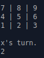
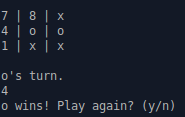

# tictactoe
An assignment from [The Odin Project](https://www.theodinproject.com/) to implement a two player gmae of tictactoe.

Additional information can be found at https://www.theodinproject.com/lessons/ruby-tic-tac-toe

## How to Play

| <code>ruby lib/game.rb</code>

A 3 by 3 grid will be displayed with the numbers 1 to 9 indicating the cells.
Input by the current players turn will be prompted. Enter the number of the cell you wish to play.

| <code>exit</code> can be used at any time to exit

## Features

- only valid input is allowed
- win condition when three in a row is achieved

## Technologies
- Written in Ruby.
- Git for version control
- rspec for testing